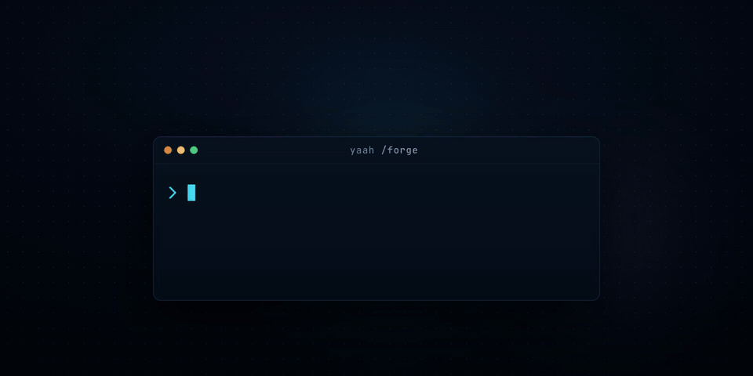

<p align="center">
  
</p>

<p align="center">
  <em><code>/forge</code> in ten seconds</em>
</p>

# yaah — Yet Another Agent Harness

A lightweight, opinionated harness for **Claude Code** that turns a one-line prompt into a
reviewed, merge-ready pull/merge request — with almost no babysitting.

Its centerpiece is **`/forge`**: a single skill that chains eight focused skills into
one autonomous pipeline. You answer questions during a requirements grilling, then
approve once before merge. Everything in between — issue creation, implementation,
code review, fix loops, knowledge-graph refresh, rebasing onto the latest default
branch — runs hands-off, each step inside an isolated git worktree so you can run many
forges in parallel without them colliding.

**This is built for real software engineers who want to ship — and align properly while
they do it.** Not a demo, not a vibe-coding toy that hands you a pile of unreviewed
diffs. `/forge` is opinionated about what "done" means, and a few principles run through
the whole thing:

- **Alignment before code.** Nothing gets built until the requirements are pinned down
  with you. The grilling phase is where you and the agent agree on *what* and *why*; the
  rest of the pipeline is just honoring that contract.
- **Ship reviewed work, never raw output.** Every change is test-driven and run through
  a strict review→fix loop until it's clean — no round limit, no "good enough." What
  lands is something you'd be comfortable putting your name on.
- **Stay in the loop where it matters, out of it where it doesn't.** Two human
  touchpoints — the requirements interview and the final merge approval. Between them the
  agent doesn't pester you; it just does the work and fixes its own mistakes.
- **Never merge blindly.** The one approval rebases onto the latest default branch and
  re-runs review against the freshly-merged context before it merges. Your main branch
  stays honest.
- **Reuse the community's best, don't reinvent.** Each phase is a real, standalone skill
  from people who solved that problem well — `/forge` is the glue, not a monolith.

**Stack-agnostic and tracker-agnostic.** forge works on any language/build system and
with either **GitHub (`gh`)** or **GitLab (`glab`)**. It carries no hardcoded stack: a
one-time `/setup-yaah` interview writes a per-repo `.yaah/config.yml` (tracker, default
branch, test/lint commands, issue label, token-efficiency tools) that forge reads at run time.

---

## Why this exists

Good agent skills already exist for the individual steps — interrogating a plan,
slicing it into issues, writing tests first, reviewing for quality. The friction is
**stitching them together**: remembering the order, carrying state between them, not
dropping the ball between "tests pass" and "actually merged". `/forge` encodes that
glue once, as a contract:

- **Two human touchpoints, no more.** You're in the loop for the requirements
  interview and the final merge approval. Between them the pipeline does not stop to
  ask — a failing test just triggers another fix round; only a true hard blocker
  (no repo, no auth, an unresolvable rebase conflict) halts the run.
- **No review-round cap.** The review→fix loop repeats until the reviewer is
  satisfied, not until a counter runs out.
- **Isolated by construction.** Each run gets its own worktree branched off the latest
  default branch. The main checkout is never touched until you approve the merge, so N
  concurrent runs never step on each other.
- **Config-driven, not hardcoded.** No stack or tracker assumptions live in the skills;
  they all come from `.yaah/config.yml`, so the same harness fits a Flutter app, a Rust
  crate, a Go service, or a Node monorepo on GitHub or GitLab.
- **Reuse, don't reinvent.** Every phase invokes a real, independently-useful skill.
  `/forge` is orchestration, not a monolith — you can still use each sub-skill alone.

---

## Quick start

```bash
git clone https://github.com/hamza-sahin/yaah.git
cd yaah
./install.sh                         # global: ~/.claude/skills
# or: ./install.sh --project /path/to/repo
```

Then, inside Claude Code in your project:

```
/setup-yaah        # once per repo — interviews you, writes .yaah/config.yml
/forge add a dark-mode toggle to settings
```

`/setup-yaah` detects your stack and tracker, confirms each choice with you, and writes
the config. `/forge` then runs the full pipeline.

---

## The flow

```
/forge <what to build or fix>

Phase 0  CONFIG+WT read .yaah/config.yml, create an isolated worktree off the
                   latest default branch, cd in   (runs /setup-yaah if no config)
Phase 1  GRILL     /grill-with-docs        interactive — lock requirements + docs
Phase 2  PRD+ISSUES /to-prd → /to-issues   publish a PRD parent issue, then child tasks
                                           attached to it (task-list + Parent refs)
Phase 3  BUILD     /handoff → implementer (claude | cursor | codex) → /tdd
                                           work the child issues one-by-one in ONE PR/MR (or in parallel
                                           on per-issue branches when implementer.workflow=true) —
                                           one commit per issue, check its PRD box, link + close the issue
Phase 4  REVIEW    spec-compliance (/spec-compliance-review) AND
                   quality (/thermo-nuclear-code-quality-review), read-only reviewers
                                           review → fix loop until both clean (no cap)
Phase 5  RECAP     summarize the run
Phase 6  MERGE     ── the one approval ──
                   on approval: rebase onto latest default branch → graphify →
                   force-push → re-run the review loop once to verify → merge →
                   tear the worktree down
```

**Phase 6 in detail.** When you approve, `/forge` does not merge blindly. It fetches
the default branch, **rebases** the PR/MR branch onto the latest tip (a rebase, never a
merge commit, so concurrent changes are preserved rather than papered over), refreshes
the knowledge graph (`graphify update .`, always — skipped only if the binary is absent),
force-pushes with `--force-with-lease`, and runs the
review loop **one more time** as verification against the freshly-merged context. Only
when that pass is clean does it merge. An unresolvable rebase conflict is surfaced as a
hard blocker instead of being forced.

---

## What's in the box

| Skill | Role | Standalone | Source |
|-------|------|------------|--------|
| **setup-yaah** | One-time interactive setup. Detects stack + tracker + default branch, confirms with you, offers to install the token-efficiency tools, writes `.yaah/config.yml`. Bundles `scm-commands.md` (the GitHub-vs-GitLab command recipes) and `efficiency-tools.md` (graphify/rtk/caveman install + wiring). | run once | yaah |
| **forge** | The orchestrator. `SKILL.md` is the spine; `PLAYBOOK.md` holds per-phase mechanics + subagent prompt templates; `scripts/forge-worktree.sh` creates/removes isolated worktrees; `scripts/forge-implement.sh` runs the cursor/codex CLI engines (prompt passed as a file, safe argv, parsed receipt). | — | yaah |
| **grill-with-docs** | Phase 1 — interrogates the plan against your domain model, sharpens terminology, updates `CONTEXT.md` / ADRs inline. | ✅ | [mattpocock](#credits) |
| **to-prd** | Phase 2 — synthesizes the grilled context into a PRD and files it as the parent issue. | ✅ | [mattpocock](#credits) |
| **to-issues** | Phase 2 — breaks the PRD into tracer-bullet vertical slices and files them as child issues (Parent ref + PRD task-list) in dependency order. | ✅ | [mattpocock](#credits) |
| **handoff** | Phase 3 — compacts context into a tight brief for the implementing subagent. | ✅ | [mattpocock](#credits) |
| **tdd** | Phase 3 — red→green→refactor with mandatory verify-RED/verify-GREEN (run the test, watch it fail then pass) and the Iron Law. Bundles `tests.md`, `mocking.md`, `deep-modules.md`, `interface-design.md`, `refactoring.md`. | ✅ | [mattpocock](#credits) |
| **systematic-debugging** | Phase 3 — invoked when a check won't go green: a four-phase root-cause discipline (investigate → pattern → hypothesis → fix) that replaces blind retry. Bundles `root-cause-tracing.md`, `defense-in-depth.md`, `condition-based-waiting.md`, `find-polluter.sh`. | ✅ | [superpowers](#credits) |
| **spec-compliance-review** | Phase 4 (leg a) — read-only review that the change does the **right** thing: spec/acceptance-criteria compliance (missing/extra/misunderstood), correctness bugs, and security. Returns a can't-verify-from-diff verdict. | ✅ | [superpowers](#credits) |
| **thermo-nuclear-code-quality-review** | Phase 4 (leg b) — an unusually strict maintainability review hunting "code-judo" simplifications, giant files, spaghetti growth. | ✅ | [cursor](#credits) |

Only **forge** and **setup-yaah** are original to yaah. The eight sub-skills are
third-party work — see [Credits](#credits).

---

## Token-efficiency tools

`/setup-yaah` also offers to install three optional, independent tools that cut token
use while an agent works your repo. It detects each, shows the exact install command,
and asks before running anything (these touch global state or need a Claude Code
restart). Full recipes live in `setup-yaah/efficiency-tools.md`; choices are recorded
under `tools:` in `.yaah/config.yml`.

| Tool | Saves | Scope | forge integration |
|------|-------|-------|-------------------|
| **[graphify](https://github.com/safishamsi/graphify)** | input — query a codebase graph instead of grepping/reading raw files | binary global; graph + hook **per-repo** | **always** — explores via `graphify query` + refreshes the graph in Phase 6 (`graphify update .`) |
| **[rtk](https://github.com/rtk-ai/rtk)** | input — rewrites shell commands to token-lean equivalents | **global** (machine-level) | **always** — global hook covers the orchestrator + Agent subagents; CLI-engine prompts say "prefix shell with `rtk`" |
| **[caveman](https://github.com/JuliusBrussee/caveman)** | output — answers the agent gives are made terse | **global** (machine-level) | **always** — global hook covers the orchestrator + Agent subagents; CLI-engine prompts say "keep working output terse" |

**forge always uses all three regardless of the `tools.*` flags** and instructs every
subagent to as well — the flags only record what `/setup-yaah` detected and wired, never a
gate. **graphify** drives forge's own steps (graphify-first exploration + the Phase 6
refresh); **rtk** and **caveman** ride their global hooks for the orchestrator and
Agent-tool subagents, and forge's cursor/codex CLI prompts carry the `rtk` + terse-output
instructions explicitly because those CLIs run outside the hooks. Code, commits, PR/MR
bodies, and security notes always stay in normal prose.

---

## `.yaah/config.yml`

Written by `/setup-yaah`, read by `/forge`. Example:

```yaml
scm: github            # github | gitlab
cli: gh                # gh | glab   (must match scm)
default_branch: ""     # branch name, or "" to auto-detect origin's default
issue_label: ""        # label applied to forge-created issues, or "" for none
checks:                # run in order; each MUST exit non-zero on failure
  - "npm test"
  - "npm run lint"
smoke: []              # optional: commands proving the artifact RUNS (boot+health, --help,
                       # build+start). Re-run by forge before merge. Empty = skip (libraries).

implementer:              # engine that runs the Phase 3 build + Phase 4 fix loop
  engine: claude          # claude (Claude Code subagent) | cursor (cursor-agent CLI) | codex (codex exec CLI)
  model: ""               # claude: sonnet|opus|haiku alias (""=inherit); cursor/codex: engine-specific id (""=default)
  agent: general-purpose  # claude only: subagent type to invoke (needs Bash + tracker CLI + edit tools)
  workflow: false         # all engines: true = parallel branch-per-issue build (claude: Workflow tool; cursor/codex: one background forge-implement.sh per child)

tools:                 # token-efficiency tools (all optional, independent)
  graphify: false      # codebase knowledge graph; forge runs `graphify update .` in Phase 6
  rtk: false           # token-saving Bash proxy (global PreToolUse hook)
  caveman: false       # terse-output agent mode (global Claude Code plugin)
```

> **Pluggable implementer.** The agent that writes the code in Phase 3 (and every Phase 4
> fix round) is swappable. `engine: claude` (default) spawns a Claude Code subagent; the two
> CLI engines instead shell out to a headless coding-agent binary inside the worktree, fully
> autonomous, returning the same receipt:
> - `engine: cursor` → [`cursor-agent`](https://cursor.com/cli) (`-p --force --trust`), authed via `CURSOR_API_KEY` or `cursor-agent login`.
> - `engine: codex` → OpenAI [`codex exec`](https://developers.openai.com/codex/cli) (`--dangerously-bypass-approvals-and-sandbox`), authed via `codex login` or `OPENAI_API_KEY`.
>
> Same build/fix prompt either way — only the delivery changes. The CLI engines are driven by
> a bundled `scripts/forge-implement.sh` (the prompt is passed as a `.md` file, argv is built
> safely, the receipt is parsed) so the orchestrator never hand-assembles a fragile shell
> command. forge preflights the chosen CLI at Phase 0 (a missing/unauthed binary is a hard
> blocker). `model` is engine-specific — for `claude` it's the `sonnet`/`opus`/`haiku` alias
> (blank = inherit the session model); reset it when switching engines.
>
> **Claude-engine extra.** With `engine: claude` you can also set `agent` — which subagent type
> forge invokes (default `general-purpose`; it must have Bash + the tracker CLI + edit tools).
> cursor/codex ignore it.
>
> **Parallel build (any engine).** Set `workflow: true` for a **true parallel build**:
> dependency-independent child issues are built concurrently, each on its own issue branch in its
> own worktree, then squash-merged **one at a time** into a PRD integration branch (the merge is
> serialized because GitHub won't lock an unprotected branch; each child is closed by hand since
> its internal PR targets a non-default branch). The fan-out differs by engine: **claude** uses the
> Workflow tool (auto-cleaned worktrees); **cursor/codex** have the orchestrator launch one background
> `scripts/forge-implement.sh` per child — each with its own per-child handoff in its own
> `forge-worktree.sh` worktree — and run the serial merge barrier itself (heavier: several concurrent
> CLI coding agents, so forge caps the concurrency). There is still exactly one user merge gate — that
> integration branch → default. A missing `implementer` block (or missing `agent`/`workflow`) reads as
> `claude` / `general-purpose` / `workflow:false`.

> Older configs may carry a top-level `graphify: true` instead of the `tools:` block;
> forge still honors it. New configs written by `/setup-yaah` use the block.

Commit it so your whole team — and every agent — shares one setup. Re-run `/setup-yaah`
anytime to change a value.

---

## Requirements

- **Claude Code** (skills + the Skill/Agent tools).
- **git ≥ 2.5** — `forge-worktree.sh` uses `git worktree`.
- **A tracker CLI, authenticated:**
  - GitHub → [`gh`](https://cli.github.com/) (`gh auth login`)
  - GitLab → [`glab`](https://gitlab.com/gitlab-org/cli) (`glab auth login`)
- *(optional)* **Token-efficiency tools** — `/setup-yaah` can install them, or do it yourself:
  - **graphify** → `pip install graphifyy` (forge explores graphify-first and Phase 6 always runs `graphify update .`, regardless of the flag; if the binary is absent, forge notes it and continues).
  - **rtk** → `brew install rtk` then `rtk init -g` (global Bash proxy; restart Claude Code).
  - **caveman** → `curl -fsSL https://raw.githubusercontent.com/JuliusBrussee/caveman/main/install.sh | bash` (Node ≥18; restart Claude Code).

No language/runtime is required by yaah itself — your `checks` commands decide what runs.

---

## Credits

yaah only exists because the community shared its work first. 🙏 We wrote the glue —
the orchestration (`forge`) and the setup interview (`setup-yaah`) are ours — but the
eight skills it chains together come from people who figured the hard parts out before
us. Huge thanks to them:

- **[mattpocock/skills](https://github.com/mattpocock/skills)** — `grill-with-docs`,
  `to-prd`, `to-issues`, `handoff`, and `tdd` are from Matt Pocock's lovely skills
  collection. Go star his repo.
- **[cursor/plugins](https://github.com/cursor/plugins/blob/main/cursor-team-kit/skills/thermo-nuclear-code-quality-review/SKILL.md)**
  — `thermo-nuclear-code-quality-review` comes from the Cursor team kit. Thanks, Cursor
  folks.
- **[obra/superpowers](https://github.com/obra/superpowers)** (MIT) — `systematic-debugging`
  (SKILL + `root-cause-tracing`, `defense-in-depth`, `condition-based-waiting`, `find-polluter.sh`)
  is vendored from Superpowers. `spec-compliance-review` is synthesized from its
  `task-reviewer-prompt.md` (spec-compliance + can't-verify verdict) and
  `requesting-code-review/code-reviewer.md` (correctness/security rubric). The
  verify-RED/verify-GREEN and Iron Law hardening of `tdd`, the implementer push-back path
  (`receiving-code-review`), and the typed implementer-status protocol
  (`subagent-driven-development`) also draw on its skills. Thanks to Jesse Vincent and the
  Prime Radiant crew.

We vendor these here so the pipeline works the moment you clone it — but please check
out the upstream repos for the canonical versions, updates, and licenses. And if you're
one of the authors: this is *your* work, so if you'd like the attribution worded
differently, a link changed, or a submodule reference instead of a vendored copy, just
open an issue and we'll happily sort it out.

The optional token-efficiency tools are separate projects we don't vendor — yaah simply
installs and configures them once you say yes. Big thanks to the people behind them too:

- **[graphify](https://github.com/safishamsi/graphify)** by Safi Shamsi — codebase
  knowledge graph (`pip install graphifyy`).
- **[rtk](https://github.com/rtk-ai/rtk)** by rtk-ai — token-saving command proxy.
- **[caveman](https://github.com/JuliusBrussee/caveman)** by Julius Brussee — terse
  agent-output mode.

---

## Nominate a skill

yaah is lightweight on purpose, but it's far from finished — and we'd genuinely love your
help shaping it. Know a skill that would sharpen one of the phases, or replace a manual
step with something repeatable? Bring it to us:

- **Got an idea?** Open an issue titled `nominate: <skill-name>` — even a rough sketch
  is welcome. Tell us which phase it improves (or whether it's a whole new one) and why
  it'd beat what we do today.
- **Ready to ship it?** Open a PR adding it under `.claude/skills/`, with a one-line
  entry in the table above and a note in Credits so its author gets the love.
- **Just here to chat?** Issues and discussions are open. Questions, half-baked
  thoughts, and "wouldn't it be cool if…" are all fair game.

We'll always credit where things came from, and we'll always tell you what we think.
Looking forward to building this with you. 🚀

## License

[MIT](LICENSE) © Hamza Sahin — applies to the original yaah work (`forge`,
`setup-yaah`, README, `install.sh`). Vendored sub-skills remain under their upstream
licenses; see [Credits](#credits).
